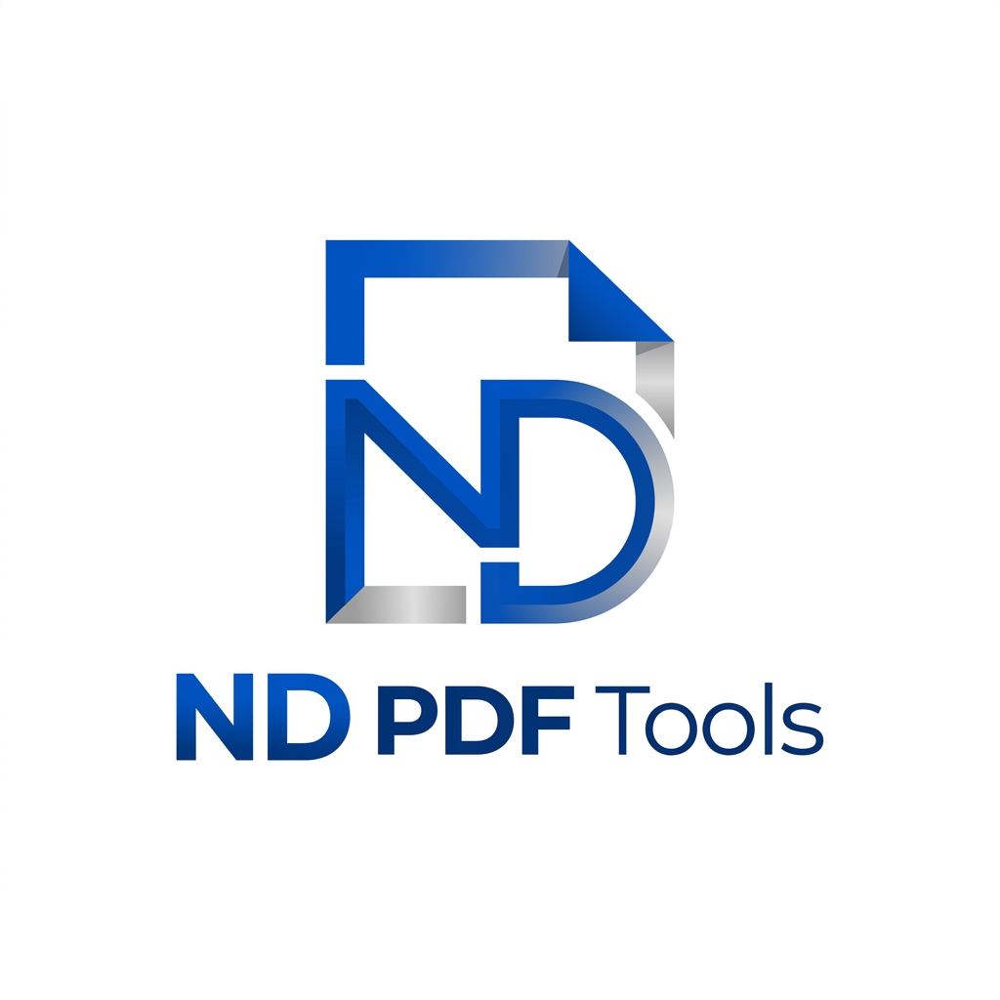

<p align="center">
  
</p>

<h1 align="center">ND PDF Tools</h1>

<p align="center">
  <b>A privacy-first, client-side web suite for compiling, compressing, cropping, annotating, and managing PDF documents.</b>
</p>

---

## 🌟 Overview

**ND PDF Tools** is a browser-based, full-featured PDF manipulation toolkit designed with privacy and speed in mind. Process your PDFs entirely in your browser without uploading sensitive files to external servers. Whether you need to merge multiple documents, reorder or rotate pages, strip bloated metadata, compress images, crop margins, or annotate pages, ND PDF Tools handles it all seamlessly on your device.

---

## ✨ Key Features

- 🔒 **100% Client-Side Privacy**: All document processing, rendering, and PDF compilation take place locally inside your browser using Web Workers and `pdf-lib`. No files are ever uploaded or stored on remote servers.
- 📑 **Page Management & Reordering**:
  - Merge multiple PDF files into a single master document.
  - Interactive drag-and-drop page reordering.
  - Page-level controls: rotate (90° steps), duplicate, or delete individual pages.
- ⚡ **Smart Compression & DPI Control**:
  - Configurable target resolution (Draft 72 DPI, Screen 150 DPI, Print 300 DPI, or Original DPI).
  - Advanced data stripping options:
    - **Strip Metadata**: Purge producer, author, title, and application creation tags.
    - **Remove Unused Fonts**: Compress embedded subset font descriptors.
    - **Remove Hyperlinks & Annotations**: Clean interactive links and web URI actions.
  - Real-time estimated file size reduction preview before exporting.
- ✂️ **Visual Cropping**: Precision canvas-based cropping tool to eliminate unnecessary headers, footers, or margins from any page.
- ✍️ **Text & Note Annotations**: Add text overlays, notes, or signatures to pages with customizable font size, alignment, and color choices.
- 🖼️ **Multi-Format Export Options**:
  - Export as a single compiled PDF.
  - Export pages as high-resolution PNG or JPEG images.
  - Bulk export images packaged in a `.zip` archive.
- ↩️ **Undo/Redo History**: Comprehensive step-by-step editing history to easily revert changes.

---

## 🚀 How to Use

### 1. Upload Documents
- Drag and drop your PDF file(s) onto the upload area, or click **Browse Files** to select documents from your computer.
- You can upload multiple PDFs at once to merge them into a single workspace.

### 2. Organize Pages
- **Reorder**: Click and drag any page card to rearrange its sequence in the document, or use the arrow buttons (`←` / `→`).
- **Rotate**: Click the rotate icon (`↻`) on any page card to turn it 90 degrees clockwise.
- **Duplicate & Delete**: Duplicate pages with the copy button (`📋`) or delete unwanted pages with the trash icon (`🗑️`).

### 3. Edit & Crop Individual Pages
- Click **Edit** on a page card to launch the page editor modal.
- Use the **Crop** tab to adjust crop bounds and trim margins.
- Use the **Annotate** tab to place text notes on the page.

### 4. Configure Optimization & Compression
- Expand the **Advanced Data Stripping & DPI** panel on the sidebar.
- Choose your target DPI (e.g., 150 DPI for web/email attachments).
- Toggle options to strip metadata, remove unused fonts, or remove hyperlinks for maximum space savings.

### 5. Process & Save
- Select your desired **Export Format** (`PDF`, `PNG`, or `JPEG`).
- Review the **Expected Outcome** size estimation.
- Click **Process & Save** to compile and download your processed document locally.

---

## 🛠️ Tech Stack

- **Framework**: [React 18](https://react.dev/) + [TypeScript](https://www.typescriptlang.org/)
- **Build Tool**: [Vite](https://vitejs.dev/)
- **Styling**: [Tailwind CSS](https://tailwindcss.com/)
- **Icons**: [Lucide React](https://lucide.dev/)
- **Animations**: [Motion](https://motion.dev/)
- **PDF Core**: [pdf-lib](https://pdf-lib.js.org/) & [PDF.js](https://mozilla.github.io/pdf.js/)
- **Archiving**: [JSZip](https://stuk.github.io/jszip/)

---

## 💻 Local Development Setup

To run ND PDF Tools locally on your machine:

1. **Clone the repository**:
   ```bash
   git clone https://github.com/aniketnaikdesai/NDPDFTOOLS.git
   cd NDPDFTOOLS
   ```

2. **Install dependencies**:
   ```bash
   npm install
   ```

3. **Start the development server**:
   ```bash
   npm run dev
   ```
   Open `http://localhost:3000` in your browser.

4. **Build for production**:
   ```bash
   npm run build
   ```

---

## 🔒 Security & Privacy Notice

ND PDF Tools operates strictly as a zero-knowledge, client-side application. Your documents are processed entirely in browser memory. No text, images, or metadata from your files are ever transmitted to any external server.
